<p align="center">
  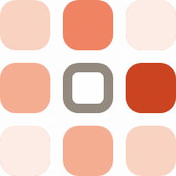
</p>

<h1 align="center">Wpasuj</h1>

<p align="center">Wrzucasz jeden link na grupę, każdy klika godziny, kiedy może. Najlepszy termin wyskakuje sam.</p>

<p align="center">
  <a href="https://wpasuj.pl"></a>
</p>

<p align="center">
  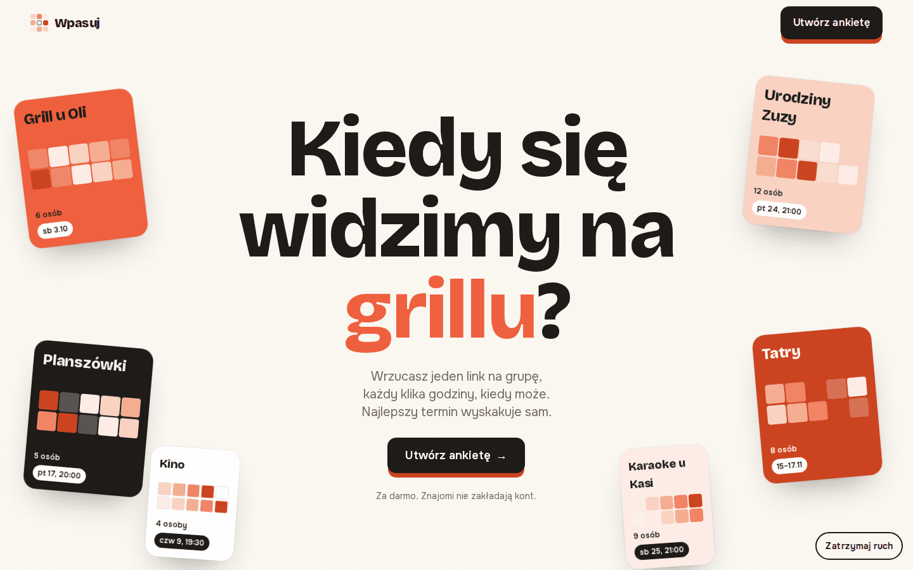
</p>

## Jak to działa

1. Wpisujesz, co robicie, i zaznaczasz dni i godziny.
2. Wrzucasz link na grupę. Znajomi wpisują imię i klikają godziny, bez zakładania konta.
3. Na „Wszyscy” widać, kiedy może najwięcej osób.
4. Ustalasz termin, a każdy dodaje go do kalendarza.

<p align="center">
  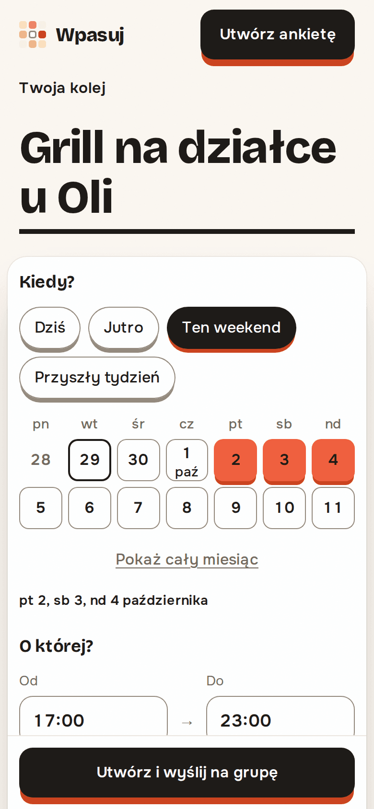
  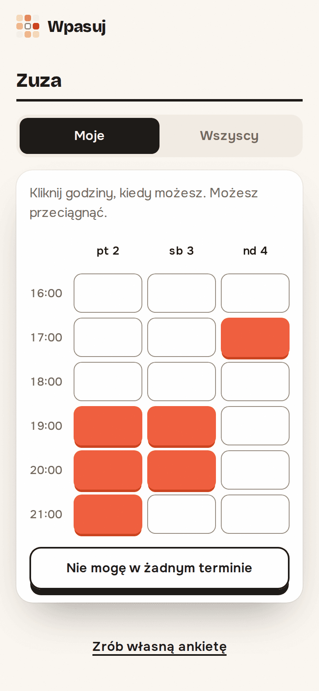
  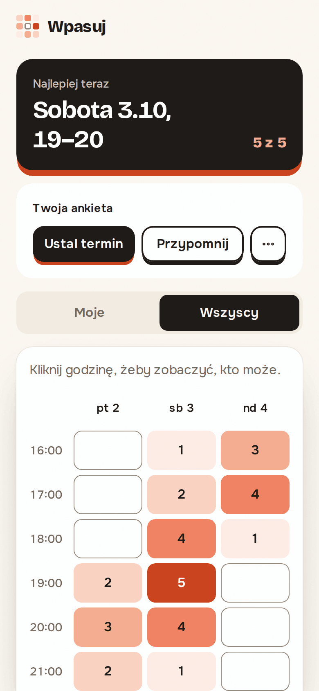
  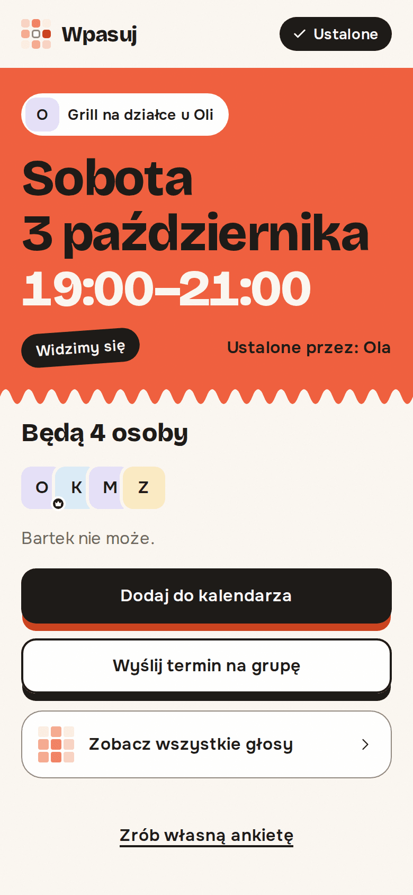
</p>

<p align="center">
  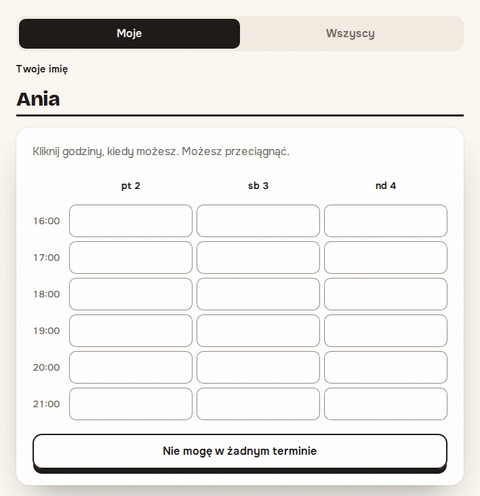
</p>

## Na komputerze

<p align="center">
  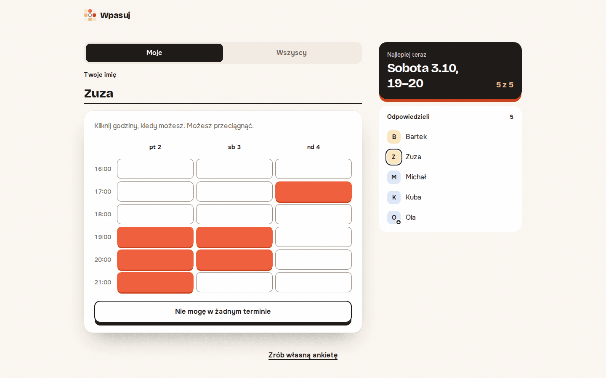
  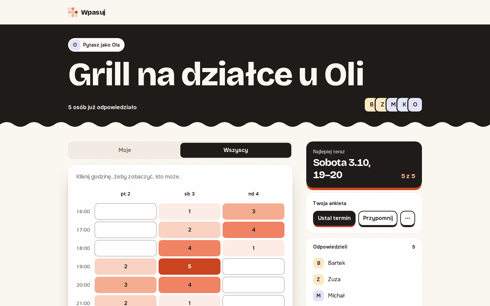
</p>

<p align="center">
  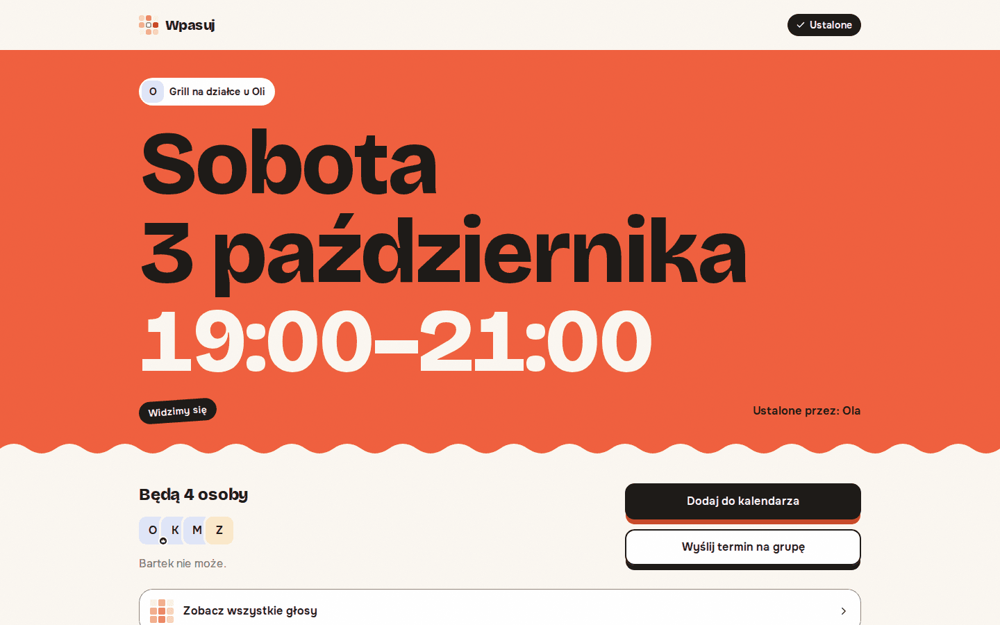
</p>

## Co umie

- Nikt nie zakłada konta, ani organizator, ani znajomi.
- Godziny zaznaczasz kliknięciem albo przeciągnięciem, także po północy.
- „Przypomnij” pisze wiadomość z imionami tych, którzy już odpowiedzieli.
- Ustalony termin trafia do kalendarza jako plik `.ics`.
- Link organizatora przenosi ankietę na drugi telefon.
- W czacie link pokazuje tytuł, dni, godziny i ile osób już odpowiedziało:

<p align="center">
  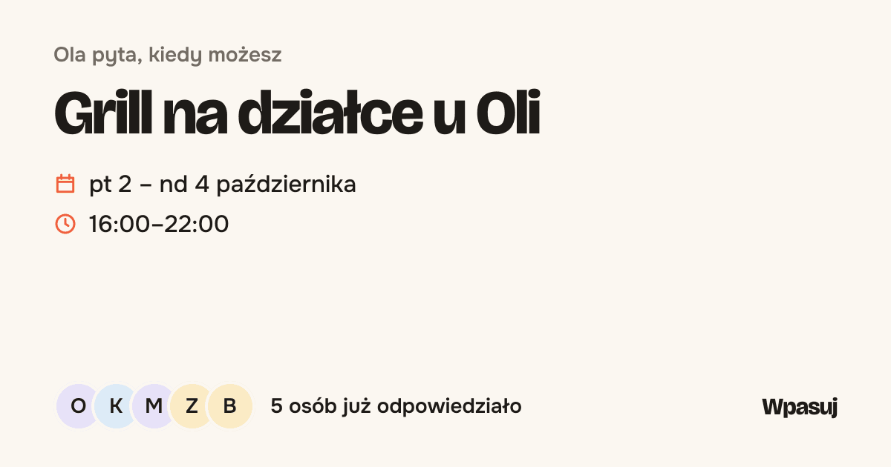
</p>

## Czego tu nie ma

Nie ma tu kont, powiadomień, komentarzy, ankiet cyklicznych, ciemnego motywu, wersji angielskiej ani analityki.

## Pod spodem

Next.js z App Routerem i server actions, TypeScript, SQLite przez Drizzle, TanStack Query do odświeżania, Tailwind v4 na własnych tokenach. Testy w Vitest i Playwright, na telefonie w Chromium i WebKit. Produkcja to jeden serwis na Railway z wolumenem na bazę.

## Uruchom u siebie

```sh
npm ci
npm run dev                  # http://localhost:3000
npm test
npm run build && npm run e2e
npm run readme:shots         # buduje aplikację i odświeża obrazki w docs/readme/
```

Baza ląduje w pliku z `DATABASE_PATH` (domyślnie `wpasuj.db` z `.env.development`).
